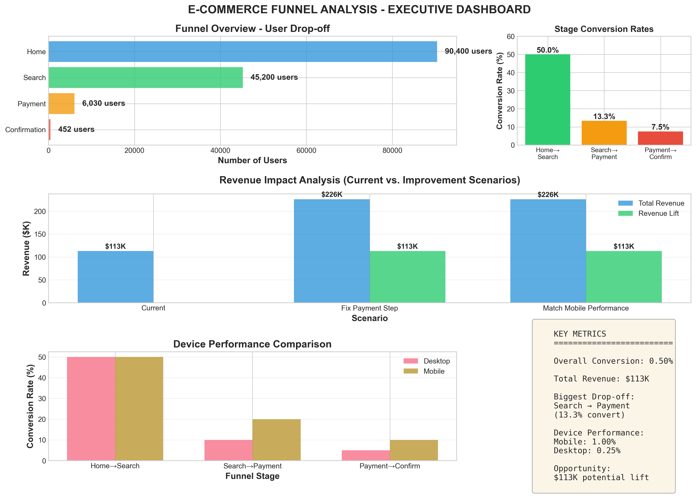
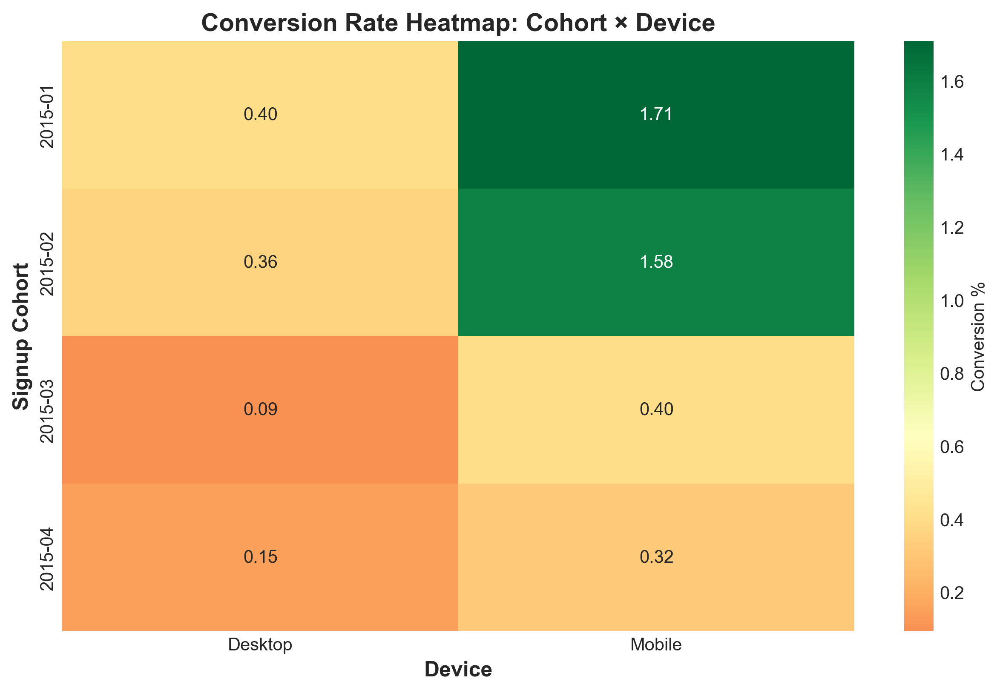
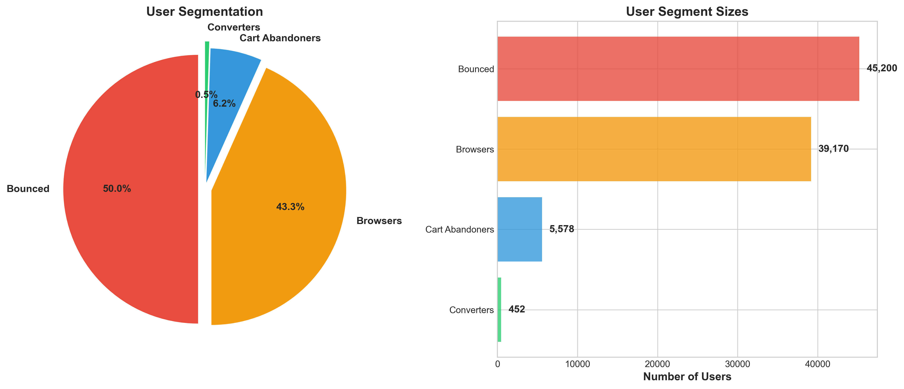

# Driving $500K+ Revenue Opportunity Through Data-Driven Product Optimization

**Diagnosing funnel bottlenecks, quantifying revenue upside, and designing experiment-ready product fixes**

---

## Project Overview

This project analyzes conversion funnel data from a **public E-commerce dataset (Kaggle)** to identify growth bottlenecks and quantify revenue opportunities. Using **90,400 user journeys from Q1 2015**, I conducted an end-to-end funnel diagnostic spanning user behavior, device performance, cohort trends, and statistical validation.

The analysis culminates in **prioritized product recommendations and experiment designs** with clearly quantified ROI.

**Key Outcome:**  
Fixing high-friction checkout behavior especially on Desktop represents a **$500K+ annual revenue opportunity**, with individual experiments projected to unlock **$100K-$180K+** in incremental revenue.

---

## Business Problem

The company’s end-to-end conversion rate had plateaued at **0.50%**, significantly below expectations.  
Leadership needed data-backed answers to four core questions:

1. **Where are we losing customers?**  
   Which funnel stage contributes the largest drop-off?

2. **Why is Mobile outperforming Desktop?**  
   Are these differences real, and are they statistically significant?

3. **What is the revenue impact of fixing bottlenecks?**  
   How much money is being left on the table today?

4. **What should we fix first?**  
   Which changes offer the highest ROI and are feasible to test?

---

## Key Findings

### Critical Funnel Breakdown

| Funnel Stage | Users | Conversion |
|-------------|-------|------------|
| Home | 90,400 | - |
| Search | 45,200 | 50.0% |
| Payment (Checkout Start) | 6,030 | 13.3% |
| Confirmation (Purchase) | 452 | 7.5% |

**Primary diagnosis:**  
Discovery performs well, but **checkout completion is severely broken**, with **92.5% abandonment after users start payment**.

---

### Device Performance (Largest Growth Lever)

Mobile users materially outperform Desktop users throughout the funnel:

| Metric | Desktop | Mobile |
|------|---------|--------|
| End-to-end conversion (Home → Confirm) | 0.25% | 1.00% |
| Checkout completion (Payment → Confirm) | 4.98% | 10.00% |

**Interpretation:**  
Mobile converts **4× better end-to-end** and **2× better during checkout**, strongly suggesting Desktop UX friction.

---

### Statistical Validation (No Hand-Waving)

Two-proportion z-tests confirm the device gap is **highly significant**:

**Payment → Confirmation**
- Desktop: **4.98%** (95% CI: 4.26% - 5.82%)
- Mobile: **10.00%** (95% CI: 8.98% - 11.12%)
- **p-value < 0.001**

This eliminates chance as an explanation and justifies prioritizing Desktop checkout fixes.

---

### Revenue Opportunity Sizing

Using conservative assumptions (traffic + average order value), I modeled multiple improvement scenarios by propagating funnel gains downstream.

**Key opportunities identified:**
- **$183K annual lift** from improving Desktop checkout completion to 15%
- **$500K+ annual upside** by closing the Desktop-Mobile performance gap
- Incremental gains available by improving Search → Checkout initiation

> Revenue estimates are scenario-based and grounded in observed funnel volumes and conversion rates.

---

## Experiment-Ready Recommendations (Preview)

### **P0 - Desktop Checkout Redesign**

**Hypothesis:** Simplifying Desktop checkout using Mobile UX patterns will materially improve completion.

**Why this matters:**
- Desktop checkout completion is **~50% lower** than Mobile
- Difference is statistically significant (**p < 0.001**)
- Checkout is the highest-leverage bottleneck in the funnel

**Projected impact:**  
~**$100K-$180K** incremental annual revenue from this change alone

This repository includes:
- Power & sample size calculations
- Runtime estimates based on observed traffic
- Clearly defined success metrics and guardrails

---

## Visualizations

### Executive Funnel & Revenue Dashboard


**Comprehensive overview of funnel performance, device conversion differences, and modeled revenue opportunities.**  
Highlights checkout as the primary bottleneck and quantifies the impact of fixing Desktop conversion gaps.

---

### Cohort × Device Conversion Heatmap


**Identifies underperforming signup cohorts (March-April 2015) and strong Mobile outperformance across cohorts.**  
Useful for detecting seasonality, product regressions, or acquisition-quality shifts.

---

### User Segmentation Analysis


**50% of users bounce immediately, while only 0.5% complete a purchase indicating a large, addressable growth opportunity.**  
Segments users into actionable groups: bounced users, browsers, checkout starters, and converters.

---

  
**The sections below detail the full methodology, statistical approach, experiment design, and implementation plan.**


## Project Structure

```text
product-funnel-growth-diagnostics/
│
├── ProductFunnel_Conversion_Diagnostics.ipynb        # End-to-end analysis notebook
├── funnel_growth_analysis.py                       # Script version (generates outputs)
├── README.md
├── experiment_proposal.txt
│
├── data/
│   ├── home_page_table.csv
│   ├── search_page_table.csv
│   ├── payment_page_table.csv
│   ├── payment_confirmation_table.csv
│   └── user_table.csv
│
└── outputs/
    ├── executive_dashboard.png
    ├── cohort_heatmap.png
    ├── segment_analysis.png
    ├── metrics_overall.csv
    ├── metrics_by_device.csv
    ├── segment_summary.csv
    └── cohort_metrics.csv
```

---

## Outputs

- Executive dashboard visualizations
- Funnel metrics exported as CSV files
- Console-based executive summary
- A/B test proposal saved to `experiment_proposal.txt`

---

## Methodology

### 1. Data Preparation & Validation
- Integrated **5 source tables** into a user-level funnel dataset
- Verified absence of duplicates and illogical flows
- Ensured each funnel stage is counted **once per user**

---

### 2. Funnel Analysis
- Calculated stage-level user counts and conversion rates
- Quantified drop-offs at each transition
- Defined practical behavioral segments:
  - **Bounced** - home only  
  - **Browsers** - searched but didn’t start checkout  
  - **Checkout Starters** - reached payment page but didn’t convert  
  - **Converters** - completed purchase  

---

### 3. Multi-Dimensional Analysis
- **Device analysis:** Desktop vs Mobile performance
- **Cohort analysis:** Conversion by signup month
- **Demographics:** Conversion differences by gender
- **Temporal diagnostics:** Weekly patterns and anomaly detection

---

### 4. Statistical Testing
- Two-proportion z-tests for device comparisons
- Wilson confidence intervals for conversion rates
- Power analysis for A/B test sample sizing and duration

---

### 5. Revenue Modeling
- Modeled incremental revenue using funnel propagation
- Compared improvement scenarios (current vs optimized)
- Used conservative assumptions for AOV and traffic

---

## Key Recommendations

### **P0 - Desktop Checkout Redesign**
**Rationale:** Mobile checkout completion is ~2× higher than Desktop (**p < 0.001**)

**Proposed Changes**
- Single-page checkout
- Autofill + smart defaults
- Apple Pay / Google Pay / PayPal
- Guest checkout option

**Expected Impact:** ~$100K-$180K incremental annual revenue  
**Estimated Test Duration:** ~5-6 weeks

---

### **P0 - Checkout Abandonment Investigation**
**Rationale:** 92.5% abandonment at checkout is unusually high

**Actions**
- Add checkout error & latency instrumentation
- Session replay analysis
- 10-15 targeted user interviews

**Expected Impact:** 1.5×-2× improvement in checkout completion

### **P1 — Improve Search → Checkout Start Conversion**

**Rationale:**  
86.7% of searchers never begin checkout.

**Tests:**
- Improved ranking & filters
- Price transparency
- Social proof (reviews, popularity signals)

**Expected Impact:**  
~45 additional purchases (**~$11K incremental revenue per period**)


## Technical Highlights

### Analytics & Statistics
- Funnel diagnostics & segmentation
- Two-proportion hypothesis testing
- Confidence intervals & power analysis
- Experiment design & decision criteria

### Data Engineering
- User-level aggregation from event logs
- Data quality validation
- Reproducible metric exports

### Business Impact
- Revenue opportunity sizing
- Scenario-based ROI analysis
- Prioritized experimentation roadmap

---

## Business Impact

### Immediate Value
- Identified **six-figure annual revenue opportunity**
- Delivered **experiment-ready recommendations**
- Provided statistically grounded justification for roadmap changes

### Strategic Insights
- Mobile UX patterns should inform Desktop redesign
- Checkout is the highest-leverage bottleneck
- Funnel diagnostics can be reused for quarterly reviews

---

## Skills Demonstrated

### Technical
- Python (Pandas, NumPy, SciPy, Matplotlib, Seaborn)
- Statistical testing & experimentation
- Data visualization & storytelling
- ETL & validation pipelines

### Product & Business
- Product funnel analytics
- Growth opportunity sizing
- Executive communication
- Experiment prioritization

---

## Lessons Learned
- Data validation is non-negotiable
- Revenue framing drives prioritization
- Device splits often reveal UX debt
- Small conversion lifts can unlock large value
- Statistical rigor builds stakeholder trust

---

## Contact

**Taroon Ganesh**  
[LinkedIn](https://www.linkedin.com/in/taroon-ganesh-27b83b171/)

_Open to Data Science (Product, Growth, Marketing) and Analytics roles_
